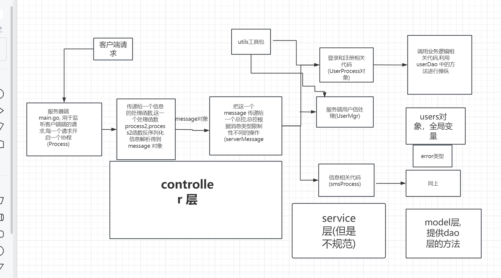
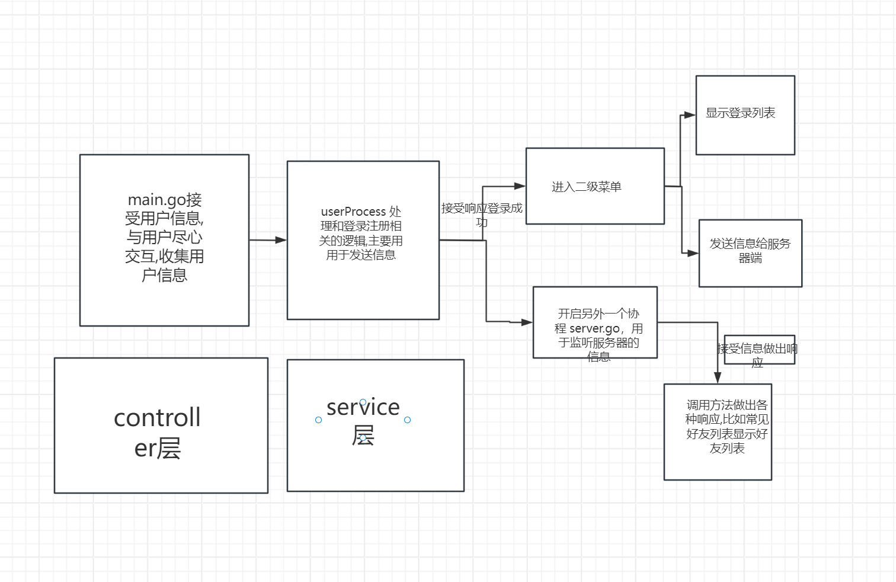
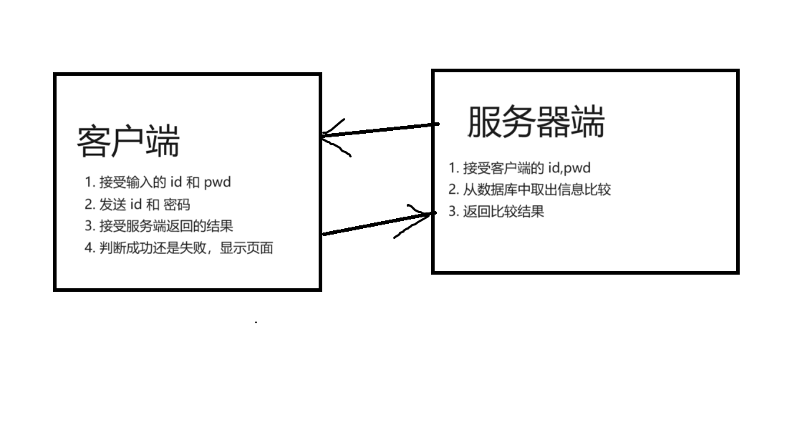
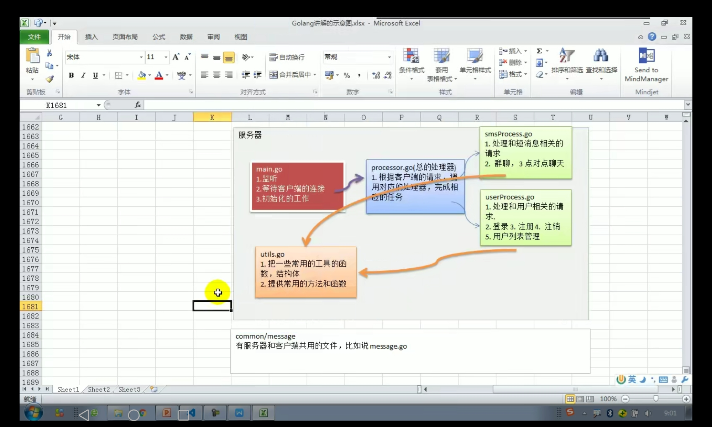
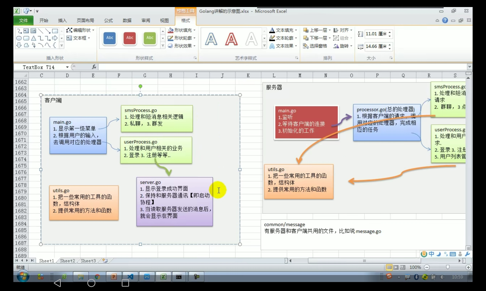
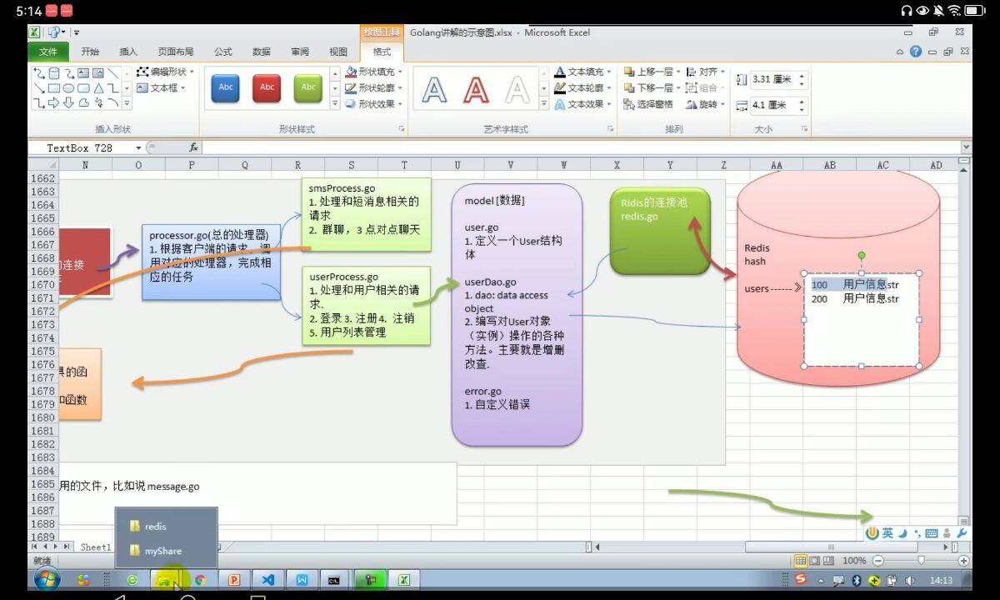
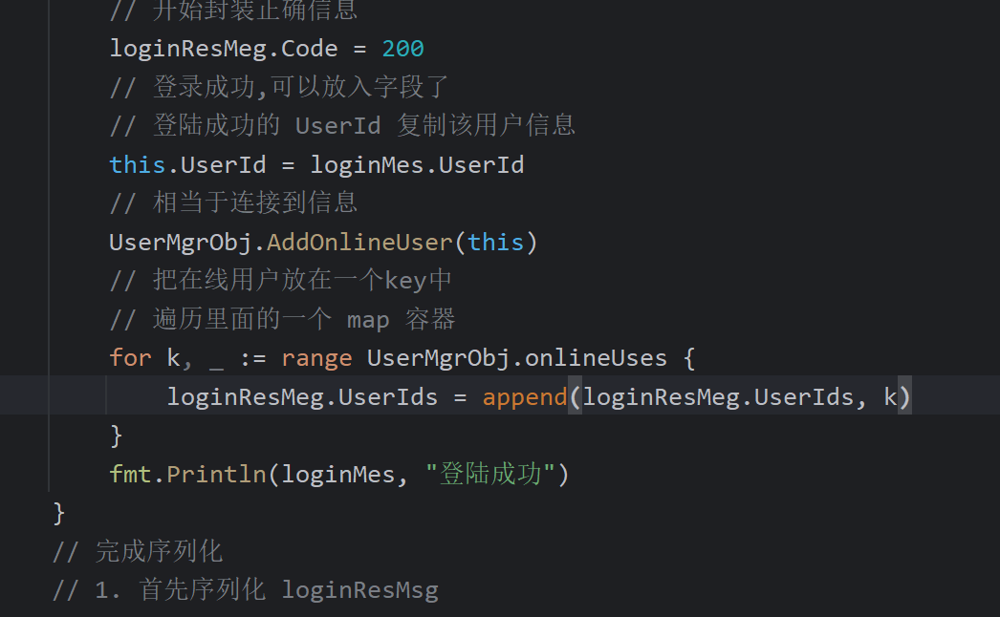

# 海量用户通信即时通信系统
## 项目架构
1. server 架构

2. client 架构

3. 另外的注意事项
   1. 注意 service 层中方法,每一个方法都要定义成一个成员方法,这样可以利用一个对象解决问题
   2. 另外注意全局变量的使用,注意创建时机
   3. 封装底层操作,比如服务器端和客户端都要用到的 utils 包
   4. 执行响应规范和返回结构规范,错误规范,利用这些规范在服务器端和客户端传递信息即可
   5. 注意 conn 的释放时机
   6. 另外补充一下, userDao常规应该封装一些底层方法到 redis 数据库中寻找数据,根据查询结构进行判断
   7. 每开发一个新的功能,就要封装成一个新的对象,最好大多数方法都是成员方法,每一次创建实例调用成员方法
## 功能实现
### 1. 显示界面用户登录界面和登录菜单
- 直接定义用户菜单,利用一个标志位记录用户的选择,另外一个标志位是否继续显示菜单,如果标志位改变就可以退出了
- 之后的每一个函数中取出 key 的值,判断 key 的值进行相关的操作
### 2. 实现用户登录

问题 : 如何设计发送数据的形式: 可以利用 json 的格式发送,但是如何设计结构体,我们认为结构体(Message)中的字段包含:
- Type(其实就是发送数据的类型)
- Data (就是用户信息对应的一个结构体 json 序列化之后的字符串),其中结构体包含用户的基本信息

发送的流程:
1. 首先创建一个 Message 的结构体
2. mes.Type = 登录(注册)消息类型
3. mes.Data = 登录消息的类型
4. 对于mes 进行一个 json 序列化
5. 但是网路中的丢包问题如何解决:
   1. 首先给服务器发送mes 的长度
   2. 之后发送 mes 序列化字符串

服务器端接收消息的流程:
1. 接收到客户端发送的长度 len
2. 根据介绍到的长度和实际接收到消息本身对比 
3. 如果不相等,利用纠错协议(但是  ......)
4. 反序列化为 mes 类型
5. 取出 mes 中的 data 信息
6. 反序列化 data
7. 在数据库中利用 data 的信息查找对应信息
8. 根据比较内容返回一个 message 信息
9. 发送给客户端

但是上面服务器端发送的一个 message 信息结构体如何设计呢? message 结构体中包含以下信息：

- code 状态码
- error 错误信息(或者提示信息)

### 3.客户端发送消息,服务器端判断消息
1. 客户端发送消息,服务器端判断信息,返回信息给客户端
2. 客户端解析接收到的消息,根据解析的消息判断用户是否登录并且显示页面
3. 需要函数封装
### 4.服务器端处理反序列化之后的消息结构体,响应不同信息
由于 Mes 相当于无论是登陆还是注册,发送的 Mes 结构体都是一样的,所以接收到消息之后,可以根据发送消息的类型调用不同的函数,根据不同的情况调用不同的函数
注意项目的架构一定需要细化,各司其职,每一次层次分明
### 5. 服务器端的优化
优化结构的方法,便于程序的可扩展性和可维护性(注意项目架构),这里可以使用 MVC 架构模式, 利用 controller 层调用不同的处理器完成相应的请求,
如何进行架构,利用 MVC 的思想, 设置一个 controller 层, 一个大的控制器中包含多个小的控制器,小的控制器中包含关于某一个方面的所有函数的选择,
首先大的一个控制器把任务分配到一个小的控制器,小的控制器再把任务交给具体的函数处理, 另外可以把常用的方法和函数放入到一个 util 包中, 直接调用其中方法即可
服务器端的项目架构图如下(另外一个注意事项就是需要把一个层中所有方法中共同的属性抽象出来,抽成一个结构体,利用这一个结构体调用方法) :

#### 优化的方法
1. 分析每一个函数和包的功能,创建相关文件
2. 首先先把分析的文件创建好,放到相应的包中
2. 将各个文件的作用不同,把函数剥离到各个包中
3. 开始调整,从最底层的开始,哪一个被调用的最多,就从哪一个开始,首先从util包开始构建

优化时的注意事项:

- 项目结构的优化方式就是把功能相关的代码抽取成函数,同时于某一个字段相关的函数放在一个包下,并且每一个包需要一个控制器控制使用哪一个函数进行操控,比如和 用户相关的操作就要使用一个包进行,
同时需要一个控制器控制登录和注册时的业务逻辑
- 另外一个重要的点就是: 把相同功能的函数抽成一个包之后,函数中经常使用的部分需要使用一个结构体完成封装,一个包对应一个结构体
- 需要定义一个主控制器,主控制器把任务分配个每一个控制器，小的控制器调用相关的函数(service层中的函数)
- 客户端和服务端相互独立,进行信息交互,都有自己的架构

### 6. 客户端的优化
1. 客户端的修改步骤基本和服务器端一致
2. 但是需要保证的一个要求就是客户端和服务器端之间一定需要有一个交互
3. 注意客户端的 controller 层的设计基本和 服务器端基本相同
4. util 包可以出现在客户端和服务端中

此时特别需要注意的就是一个 server.go ,其中就是放入的就是一个客户端和服务器端的交互过程,
其中包含了显示菜单的函数,另外定义了一个协程的任务(就是不断对服务器端的信息进行一个监听),如果服务器端显示信息,
这一个协程就会接收到信息,并且做出相应的响应(注意读取使用 ReadPkg 函数,见上面)
项目架构图:

### 7. 利用redis数据库(当然也可以使用 mysql)存储用户并且校验用户信息
#### 分析数据结构
1. 注意 redis 中的数据结构都是指的 value 的数据结构,不是指的 key的数据结构,
所以要存储用户信息就要使用 hash的数据结构
#### 添加一个model层
1. mvc 架构中,用于定义数据库中对应字段的对象定义
2. model(数据层中)定义操作对象(CRUD)的方法(有一点类似 java 中的Dao层)
3. model层中还要自定义信息
4. 需要利用服务器端维护一个连接池,每一次取出一个连接池(其实就是一个 redis.Client 对象)
架构图:

### 8. 利用 redis 数据库管理用户信息
#### 添加用户信息
1. 利用 hash 的数据结构,利用 hset 添加元素,利用 hget 查询元素
2. 但是注意hash 的值是要给json 字符串,这一个字符串中的引号需要使用转义字符引起来
3. 但是这里使用的不是一个连接池,而是封装的一个 redis.Client 对象
#### 校验用户信息
1. 首先创建了一个 userDao 对象,创建其中的一个方法GetUserDao函数(相当于 mvc 中的 dao 包),
同时创建一个方法 Login 方法根据用户名和 密码利用 GetUserDao 函数取得对象并且进行密码比较
2. 另外自定义了错误信息 Error.go
3. 同时在 main 包中添加 redis.go 函数用于初始化 redis.Client 对象 , 同时在 main 函数中写完了初始化函数(包含初始化client和初始化 userDao 函数)
4. 创建了全局变量MyUserDao 和 Client 对象,同时利用初始化对象进行操作
5. 改良了 UserProcess 中的登录业务处理逻辑
### 9. 利用 redis 进行用户的注册
分析步骤:
1. 首先先添加两个消息类型(common 包中添加),其中注册使用的字段可以使用一个User 替代
2. 在 main.go 中拿到用户信息,在 UserProcess.go 中增加一个 Register 方法,完成请求注册
3. 注意此时 Login处理的业务逻辑基本和 Register 的方法逻辑相同,大致分为以下几步 :
   1. 首先创建一个 Message 对象
   2. 创建一个 用户对象(登录或者注册用户),把用户对象序列化赋值给 mes 的 Data 字段
   3. 把 mes 序列化 , 之后调用 Transfer 中的 WritePkg 方法发送 mes 序列化之后的长度
   4. 最后 利用 ReadPkg 方法读取到一个响应的结果,利用状态码判断之后的业务逻辑
5. 在服务器端增加一个 Register 方法,首先在总控中添加一个方法(ServerRegisterMes),之后调用这一个方法就可以了
### 10. 显示用户列表
功能 :
1. 用户登录到服务器之后可以查看用户的在线状态
#### 实现思路
1. 服务器建立一个维护用户在线列表 onlineUsers map[ int ]*userProcess(其中有一个连接对象) 
(注意其中 userProcess 中有一个字段表示连接,可以利用 id 结合 userProcess来存储连接信息) 
2. 创建一个新的文件,用于承装 onlineUser map 的增删改查,用户上线就可以添加到一个列表,否则删除列表
3. 还需要改进 LoginResMes 把在线用户的 ID 返回即可 user[]int 
4. 当用户登陆之后显示当前用户列表, 但是如何显示新的用户 
5. 注意在服务器端返回登录成功的信息之前,把在线用户 id 添加到全局变量的 map 容器中, 注意把当前登录用户的 UserId 赋值给 userProcess

#### 提出问题并且解决
问题 : 问题就是只有登录时可以看到在线用户列表,没有登录的时候无法看到在线用户列表
解决方案思路 :
1. 当有一个用户上线之后,服务器就可以把当前的维护的一个 onlineUsers map 整体推送
2. 服务器有自己的策略,每隔一定时间,把维护的 onlineUsers map 整体推送
3. 逆向思考,当一个用户上线之后,服务器就把  服务器上线信息推送到所有用户
使用第三种方法的实现方式:
1. 客户端维护一个 map, map 记录了他的所有好友(目前是所有人)
2. map的类型为 map[ int ] User
3. 需要依赖于服务器端和客户端之间的交互协程 serverProcessMes 协程
#### 服务器端发送用户上线信息
1. 首先还是定义一个函数,这一个函数上线用户 的 UserId
2. 之后利用这一个 UserId 结合在线用户列表,把上线信息发送给每一个用户
3. 在登陆成功的地方调用这一个方法即可
4. 这里需要规定一个返回的协议,这里是直接定义一个 NotifyUserStatusMes 结构体用于规范发送规范
5. 之后向其他函数一样,创建 mes 对象, 把发送的信息承装在 mes 对象中,调用 WritePkg 方法发送即可
#### 客户端接受用户发送信息
1. 这里可以直接利用一个协程接受服务器端发送的一个消息,为什么(因为这一个行为发生在客户端登录之后,所以登录之后通过这一个消息处理)
2. 客户端开启一个协程 ServerMes , 这一个协程用于向客户端的一个好友列表中添加信息
3. 同时如何添加好友列表,首先把
### 11. 客户端发送消息
1. 利用之前的一个 SmsMessage 结构体,并且利用一个
2. 可以在 model 层中添加一个新的 CurUser , 这一个结构体可以存储一个信息,并且需要存储信息
3. SmsProcess 进行一个群发操作, 其实就是定义一个 send 方法,获取到 CurUser 中的一个 Conn 连接发送消息
### 12. 完成一个群发消息的功能
1. 服务器端接收消息
2. 服务器端可以通过遍历一个 onlineUser 容器,利用 userProcess 发送消息

